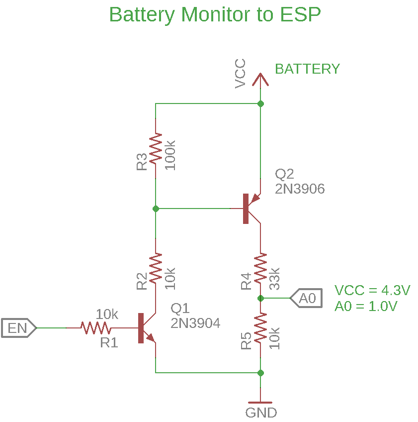
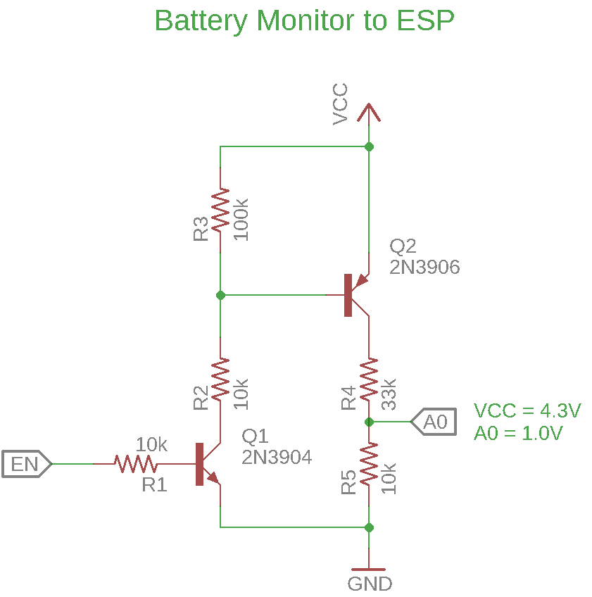

# Battery Monitor

When we need to read the voltage from a battery usually use a voltage divider, but the voltage divider will drain a little current from the battery.
The circuit below can turn on and off the voltage divider.
Now you can turn off the voltage divider and put the microcontroller to sleep mode.

## Arduino 3.3V 

This circuit was designed to work with arduino running in 3.3V, the voltage divider turn 4.3V from the li ion battery to 3.3V.
Connect A0 to any analog pin from Arduino and EN to a digital output from arduino, turn EN High to turn the voltage divider on and EN Low to turn off.

## ESP8266

This circuit was designed to work with ESP8266 running in 3.3V, the voltage divider turn 4.3V from the li ion battery to 1.0V.
Connect A0 to A0 from ESP8266 and EN to a digital output from ESP, turn EN High to turn the voltage divider on and EN Low to turn off.

